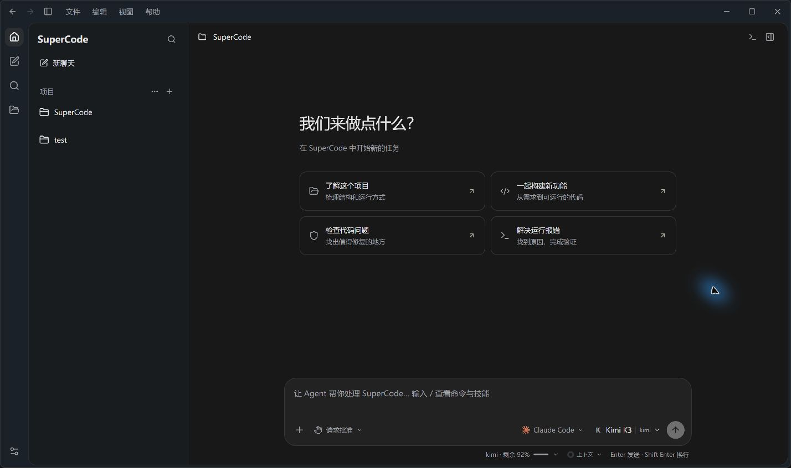
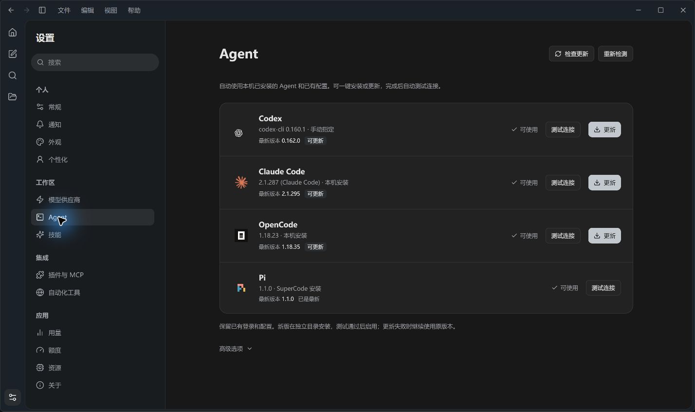
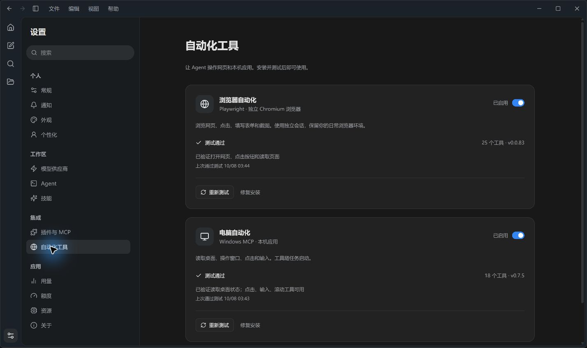

# SuperCode

把 Codex、Claude Code、OpenCode 和 Pi 放进一个桌面工作台，管理项目、模型连接和工具，直接用对话完成开发任务。

当前版本 **0.1.1**，主要支持 **Windows**。基于 Tauri 2、Rust、React + TypeScript 和 SQLite。

[下载 Windows 安装包](https://github.com/heyule69/SuperCode/releases/latest) · [版本记录](https://github.com/heyule69/SuperCode/releases)



## 功能

- **Agent 管理**：自动发现本机 Agent，显示已安装和最新版本，支持一键安装、更新与连接测试。
- **模型连接**：使用官方账号登录或配置 API，支持从 CC Switch 导入连接。
- **对话工作台**：流式回复、工具记录、文件差异、历史会话和侧边聊天；任务运行中可以追加消息、排队或引导。
- **图片与媒体**：上传、粘贴图片，在对话中查看图片、播放视频和音频。
- **技能、插件与 MCP**：发现本机技能，管理 Codex / Claude 插件和 MCP；浏览器、电脑自动化可一键安装并测试。
- **桌面体验**：深浅主题、系统通知、托盘和多窗口。聊天保存在本机，Agent 按需启动，空闲后释放。
- **软件更新**：自动检查 GitHub Releases，在「设置 → 关于」下载更新并重启安装，保留聊天与配置。

各 Agent 的权限和引导能力按原生协议提供；目前同一时间运行一个 Agent 任务。

## 开始使用

先下载安装包，选择安装目录。之后可直接在软件中更新。

1. 在「设置 → Agent」检测已有安装，缺少时点击「安装」。
2. 在「模型供应商」选择官方账号登录，或添加 API 连接。
3. 添加项目文件夹，选择 Agent 和模型，输入任务即可。

已有 Agent 的登录和配置会继续使用。下载与更新使用独立目录，测试通过后再启用。

## 界面截图

**Agent 管理**



**自动化工具**



## 从源码运行

准备 Node.js 22+、Rust、Windows C++ Build Tools 和 WebView2。

```powershell
git clone https://github.com/heyule69/SuperCode.git
cd SuperCode
npm ci
npm run desktop
```

```powershell
npm run build                                      # 构建前端
npm test                                           # 前端测试
cargo test --manifest-path src-tauri/Cargo.toml      # Rust 测试
npm run desktop:build                              # 打包桌面端
npm run installer:build                            # 构建 Logo 动画安装器
```

安装器构建还需要 Python 与 NSIS，详见 [安装器说明](installer/README.md)。
